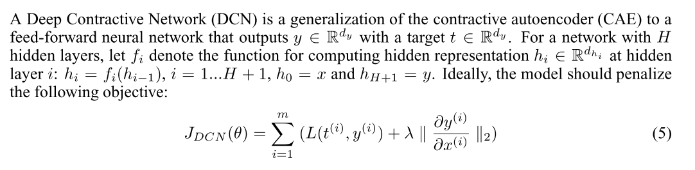
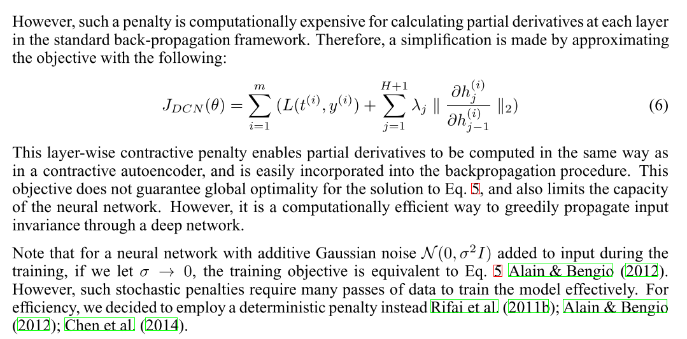

```
@article{gu2014towards,
author = {Gu, Shixiang and Rigazio, Luca},
journal = {arXiv preprint arXiv:1412.5068},
title = {{Towards deep neural network architectures robust to adversarial examples}},
year = {2014}
}
```
Dataset: MNIST

- All autoencoders are able to recover from at least 90% of of adversarial errors, regardless of the model from which it originates.
- **Drawback:** The autoencoders and its corresponding classifier can be stacked to form a new feed-forward neural network, then adversarial examples can again generated from this stacked network. Such adversarial examples have a significantly smaller distortion. One possible explanation is that since the autoencoder is trained without the knowledge of teh classification objective, it has more blind-spots with respect to that final objective.
- In particular, a denoising auto-encoder with $\sigma=0.1$ Gaussian Noise could denoise adversarial examples almost as well as an autoencoder trained on actual adversarial noises.

## Deep Contractive Network


