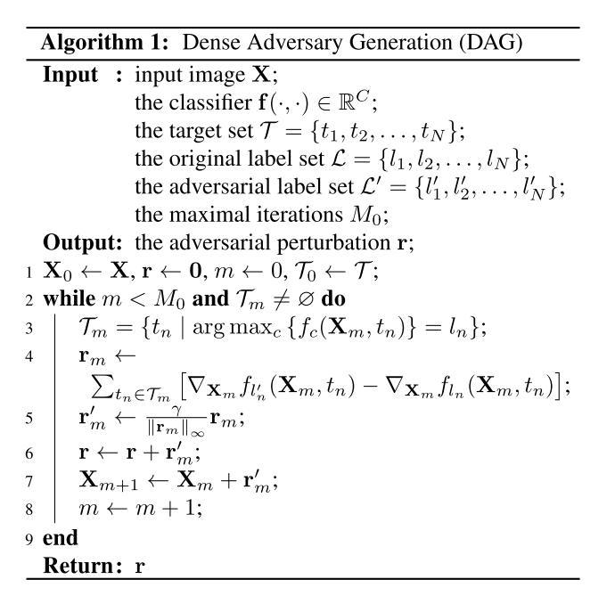

```
@inproceedings{DBLP:conf/iccv/XieWZZXY17,
author = {Xie, Cihang and Wang, Jianyu and Zhang, Zhishuai and Zhou, Yuyin and Xie, Lingxi and Yuille, Alan L},
booktitle = {{\{}IEEE{\}} International Conference on Computer Vision, {\{}ICCV{\}} 2017, Venice, Italy, October 22-29, 2017},
doi = {10.1109/ICCV.2017.153},
isbn = {978-1-5386-1032-9},
pages = {1378--1387},
publisher = {{\{}IEEE{\}} Computer Society},
title = {{Adversarial Examples for Semantic Segmentation and Object Detection}},
url = {https://doi.org/10.1109/ICCV.2017.153},
year = {2017}
}
```
## Motivation
Natural images with visually imperceptible perturbations added, cause deep networks fail on images classification. Segmentation and detection are based on classifying multiple targets on an image.

## Methods
### Dense Adversary Generation (DAG).
- DAG aims at generating recognition failures o the original proposals. To increase the robust-ness of adversarial attack, we change the intersection-over-union (IOU) rate to preserve an increased but still reason-able number of proposals in optimization.
- algorithms

- Section 3.2 describes the selection of Input proposals for detection. I am not familiar with detection algorithms, but the main idea is getting dense input proposals for robust adversarial examples.


## Findings
- Generating an adversarial example is more difficult in detection than in segmentation, as the number of targets is orders of magnitude larger in the former case.
- when the proposals are dense enough on the original image, it is highly likely that incorrect recognition results are also produced on the new proposals generated on the perturbed image.
- adding two or more heterogeneous perturbations significantly increases the transferability, which provides an effective way of performing black-box adversarial attack
- Different network structures generate roughly orthogonal perturbations. Combined perturbations is bale to confuse both network structures.