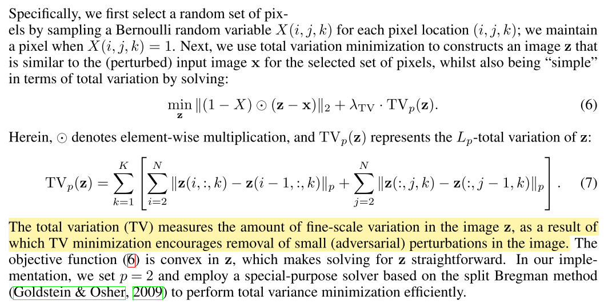
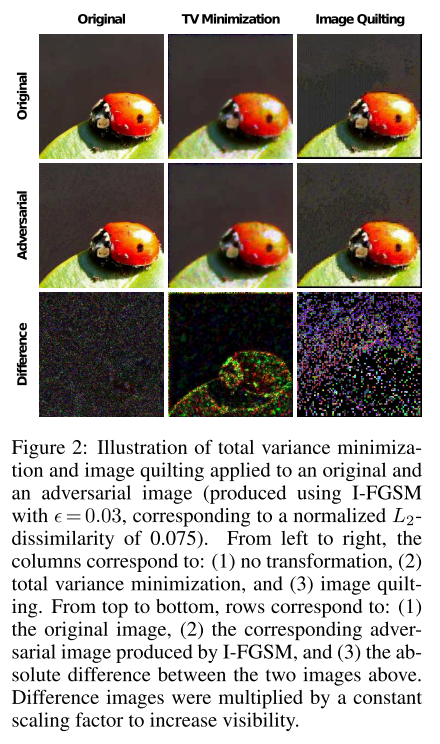

```
@article{DBLP:journals/corr/abs-1711-00117,
archivePrefix = {arXiv},
arxivId = {1711.00117},
author = {Guo, Chuan and Rana, Mayank and Ciss{\'{e}}, Moustapha and van der Maaten, Laurens},
eprint = {1711.00117},
journal = {CoRR},
title = {{Countering Adversarial Images using Input Transformations}},
url = {http://arxiv.org/abs/1711.00117},
volume = {abs/1711.0},
year = {2017}
}
```

### Total Variance Minimization
This approach randomly selects a small set of pixels, and reconstructs the “simplest” image that is consistent with the selected pixels. The re- constructed image does not contain the adver- sarial perturbations because these perturbations tend to be small and localized.



