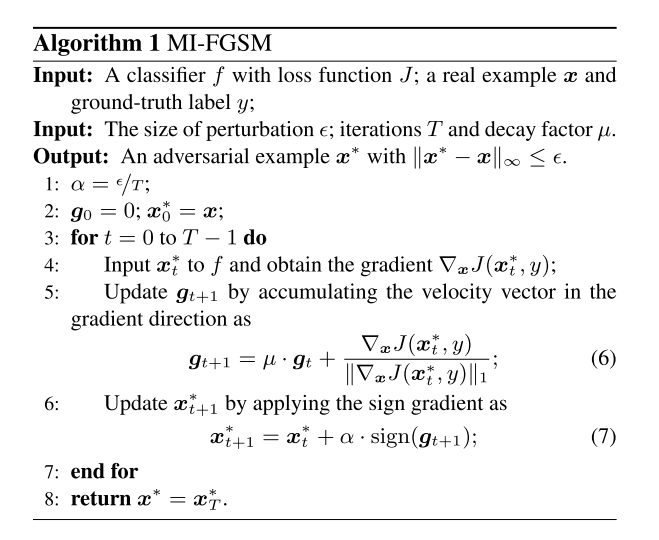
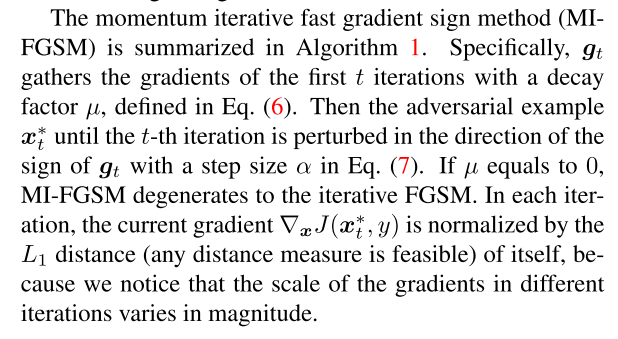

```
@inproceedings{DBLP:conf/cvpr/DongLPS0HL18,
author = {Dong, Yinpeng and Liao, Fangzhou and Pang, Tianyu and Su, Hang and Zhu, Jun and Hu, Xiaolin and Li, Jianguo},
booktitle = {2018 {\{}IEEE{\}} Conference on Computer Vision and Pattern Recognition, {\{}CVPR{\}} 2018, Salt Lake City, UT, USA, June 18-22, 2018},
doi = {10.1109/CVPR.2018.00957},
pages = {9185--9193},
publisher = {{\{}IEEE{\}} Computer Society},
title = {{Boosting Adversarial Attacks With Momentum}},
url = {http://openaccess.thecvf.com/content{\_}cvpr{\_}2018/html/Dong{\_}Boosting{\_}Adversarial{\_}Attacks{\_}CVPR{\_}2018{\_}paper.html},
year = {2018}
}
```


