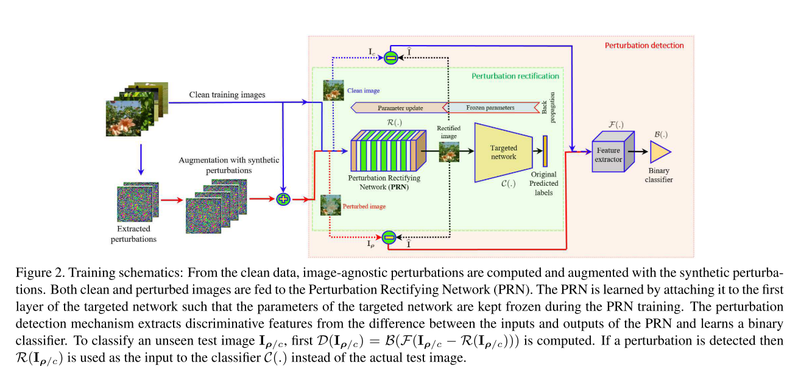

```
@inproceedings{DBLP:conf/cvpr/AkhtarLM18,
author = {Akhtar, Naveed and Liu, Jian and Mian, Ajmal},
booktitle = {2018 {\{}IEEE{\}} Conference on Computer Vision and Pattern Recognition, {\{}CVPR{\}} 2018, Salt Lake City, UT, USA, June 18-22, 2018},
doi = {10.1109/CVPR.2018.00357},
pages = {3389--3398},
publisher = {{\{}IEEE{\}} Computer Society},
title = {{Defense Against Universal Adversarial Perturbations}},
url = {http://openaccess.thecvf.com/content{\_}cvpr{\_}2018/html/Akhtar{\_}Defense{\_}Against{\_}Universal{\_}CVPR{\_}2018{\_}paper.html},
year = {2018}
}
```
## Motivation
The first paper to study defense on universal adversarial perturbations.

## Methods
A Perturbations rectifying network to remove perturbations.
A classifier to detect if there exists perturbations. They used SVM as the classifier and the log-absolute values of the 2D-DCT coefficients of the grey-scaled image.


As mentioned in the paper, synthesized perturbations are helpful to train the PRN. Thus they proposed a method to generate perturbations.


## Thoughts
- Honestly I don't understand the algorithm that synthesizes perturbations clearly.
- What's intuition for using DCT as feature extractor?