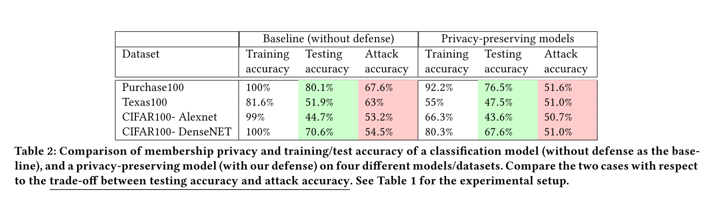

```
@inproceedings{10.1145/3243734.3243855,
address = {New York, NY, USA},
author = {Nasr, Milad and Shokri, Reza and Houmansadr, Amir},
booktitle = {Proceedings of the 2018 ACM SIGSAC Conference on Computer and Communications Security},
doi = {10.1145/3243734.3243855},
isbn = {9781450356930},
pages = {634--646},
publisher = {Association for Computing Machinery},
series = {CCS '18},
title = {{Machine Learning with Membership Privacy Using Adversarial Regularization}},
url = {https://doi.org/10.1145/3243734.3243855},
year = {2018}
}
```
## Summary
This paper adopts adversarial training to protect the membership privacy.
## Motivation
Train machine learning models that guarantee membership privacy: no adversary should be able to distinguish between the predictions of the model on its training set and other data samples from the same underlying distribution. 
The objective is to achieve membership privacy with the minimum classification.
## Method(s)
### Min-max membership privacy game
joint privacy and classification objectives optimization
$$\min _{f}(L_{D}(f)+\lambda \underbrace{\max _{h} G_{f, D, D^{\prime}}(h)}_{\text {optimal inference }})$$
## Evaluation
### Dataset
- CIFAR100
- Purchase100
- Texas100


## Conclusion
- the adversarial training for membership privacy strongly regulaizes the model. Such mechanism not only protects membership privacy but also significantly prevents overfitting.
- The min-max mechanism achieves membership privacy with minimum generalization error.
- Their privacy-preserving mechanism can guarantee maximum achievable membership privacy with only a neg- ligible drop in the model’s predictive power. To
## Related work