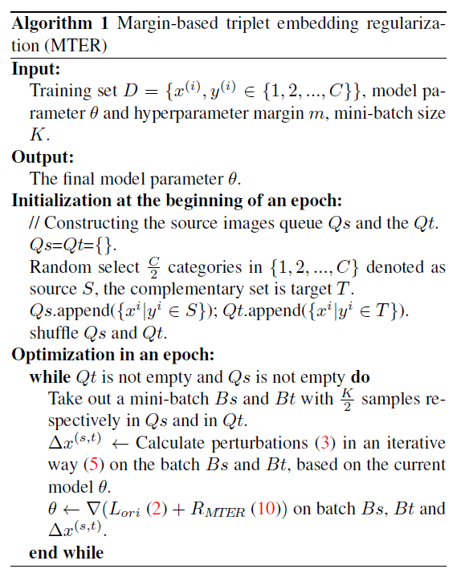
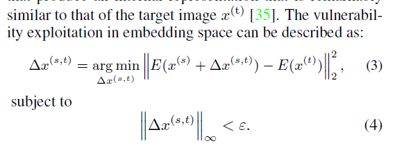
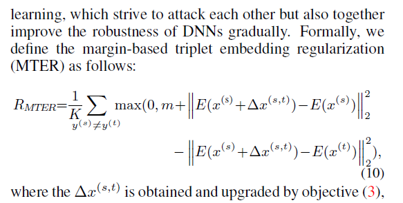

```
@inproceedings{Zhong_2019_ICCV,
author = {Zhong, Yaoyao and Deng, Weihong},
booktitle = {The IEEE International Conference on Computer Vision (ICCV)},
month = {oct},
title = {{Adversarial Learning With Margin-Based Triplet Embedding Regularization}},
year = {2019}
}
```
Put it simple, it is like a margin-based adversarial training.



