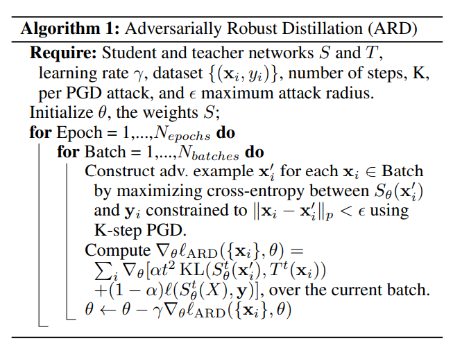

```
@inproceedings{DBLP:conf/iccv/ZhangSGCBM19,
author = {Zhang, Linfeng and Song, Jiebo and Gao, Anni and Chen, Jingwei and Bao, Chenglong and Ma, Kaisheng},
booktitle = {2019 {\{}IEEE/CVF{\}} International Conference on Computer Vision, {\{}ICCV{\}} 2019, Seoul, Korea (South), October 27 - November 2, 2019},
doi = {10.1109/ICCV.2019.00381},
pages = {3712--3721},
publisher = {IEEE},
title = {{Be Your Own Teacher: Improve the Performance of Convolutional Neural Networks via Self Distillation}},
url = {https://doi.org/10.1109/ICCV.2019.00381},
year = {2019}
}
```
## Motivation
This paper studies how adversarial robustness transfers from teacher to student during knowledge distillation.




**Not worthy reading. Writing is bad.**