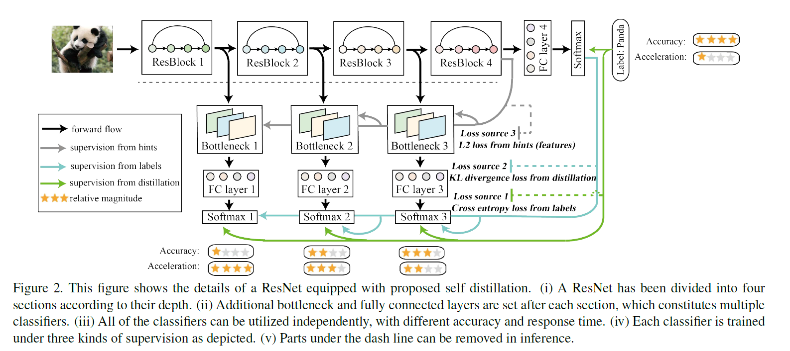

```
@inproceedings{DBLP:conf/iccv/ZhangSGCBM19,
author = {Zhang, Linfeng and Song, Jiebo and Gao, Anni and Chen, Jingwei and Bao, Chenglong and Ma, Kaisheng},
booktitle = {2019 {\{}IEEE/CVF{\}} International Conference on Computer Vision, {\{}ICCV{\}} 2019, Seoul, Korea (South), October 27 - November 2, 2019},
doi = {10.1109/ICCV.2019.00381},
pages = {3712--3721},
publisher = {IEEE},
title = {{Be Your Own Teacher: Improve the Performance of Convolutional Neural Networks via Self Distillation}},
url = {https://doi.org/10.1109/ICCV.2019.00381},
year = {2019}
}

```
## Motivation
Two existing problems in traditional knowledge distillation.
- Low efficiency on knowledge transfer, which means student model scarcely exploit all knowledge from teacher models. Rare student models outperform teacher models.
- How to design and train proper teacher models.
## Methods



#### Deep supervision
Deep supervision is based on the observation that classifiers trained on highly discriminating features can improve the performance in inference[1].

[1] Lee, C. Y., Xie, S., Gallagher, P., Zhang, Z., & Tu, Z. (2015, February). Deeply-supervised nets. In Artificial intelligence and statistics (pp. 562-570).