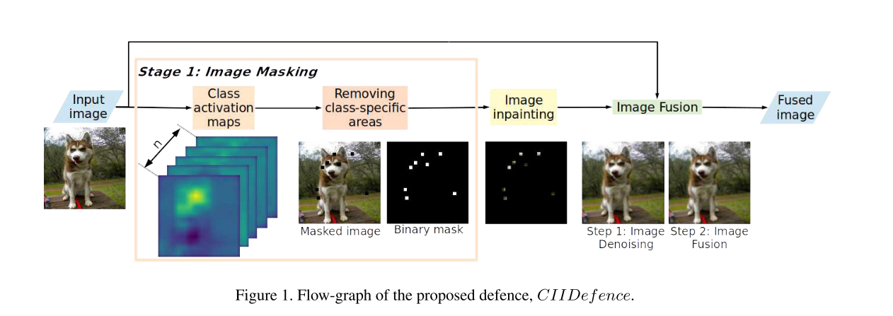

```
@inproceedings{Gupta_2019_ICCV,
author = {Gupta, Puneet and Rahtu, Esa},
booktitle = {The IEEE International Conference on Computer Vision (ICCV)},
month = {oct},
title = {{CIIDefence: Defeating Adversarial Attacks by Fusing Class-Specific Image Inpainting and Image Denoising}},
year = {2019}
}
```
