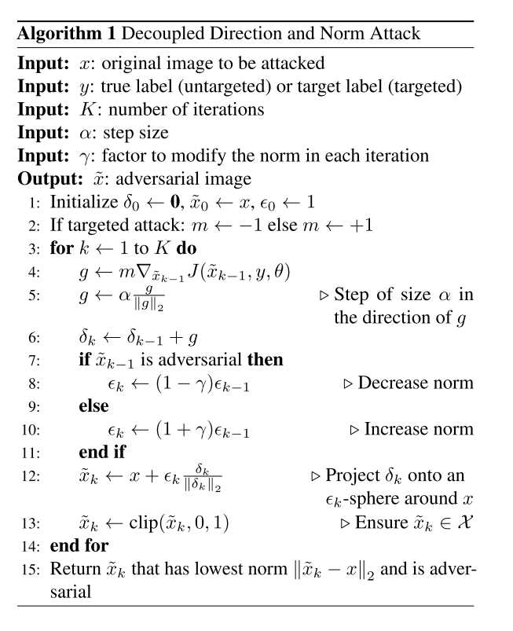

```
@inproceedings{Rony_2019_CVPR,
author = {Rony, Jerome and Hafemann, Luiz G and Oliveira, Luiz S and Ayed, Ismail Ben and Sabourin, Robert and Granger, Eric},
booktitle = {The IEEE Conference on Computer Vision and Pattern Recognition (CVPR)},
month = {jun},
title = {{Decoupling Direction and Norm for Efficient Gradient-Based L2 Adversarial Attacks and Defenses}},
year = {2019}
}
```
## Motivation
CW attack is presently the most effective white-box attack in the literature but is slow and requires thousands of iterations.

This aatack optimizes the cross-entropy loss, and instead of penalizing the norm in each iteration, projects the perturbation onto a $L_2-sphere$ centered at the original image.

## Methods
**Decoupled Direction and Norm Attack (DDN)**

Penalty methods like CW attacks result in slow convergence and need to select the hyperparameter carefully.

In this method, there is no penalty on the $L_2$ norm during the optimization. Instead, the norm is constrianed by projecting the adversarial perturbation $\delta$ on an $\epsilon-$sphere around the original image $x$.

It is like finding the lowest perturbations for $x$ to make it an adversarial example.

