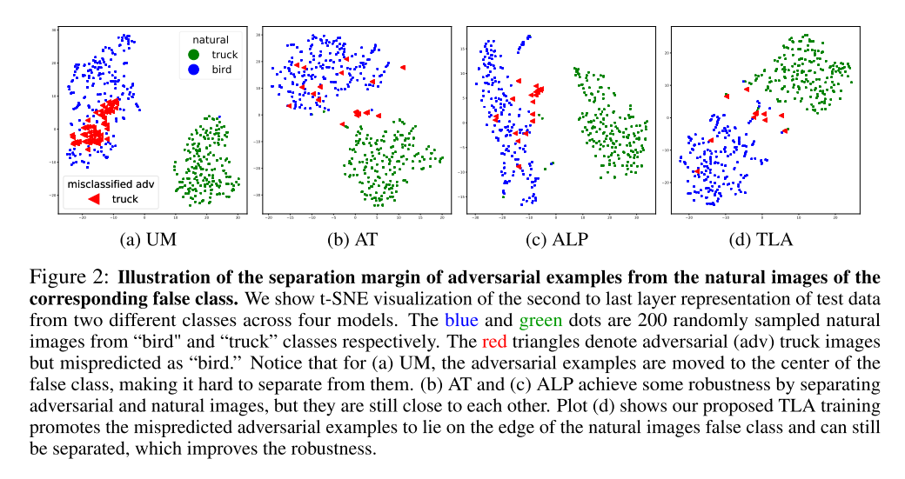
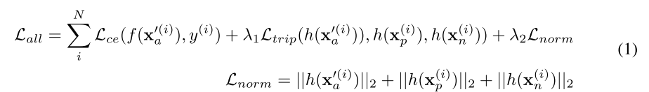

```
@incollection{NIPS2019_8339,
author = {Mao, Chengzhi and Zhong, Ziyuan and Yang, Junfeng and Vondrick, Carl and Ray, Baishakhi},
booktitle = {Advances in Neural Information Processing Systems 32},
pages = {478--489},
publisher = {Curran Associates, Inc.},
title = {{Metric Learning for Adversarial Robustness}},
url = {http://papers.nips.cc/paper/8339-metric-learning-for-adversarial-robustness.pdf},
year = {2019}
}
```
## Motivation
we investigate what happens to the latent representations as they undergo attack. Our results show that the attack shifts the latent representations of adversarial samples away from their true class and closer to the false class.
The adversarial representations often spread across the false class distribution in such a way that the natural images of the false class become indistinguishable from the adversarial images.

In short, the motivation is that the triplet loss function will pull all the images of one class, both natural and adversarial, closer while pushing the images of other classes far apart. 




