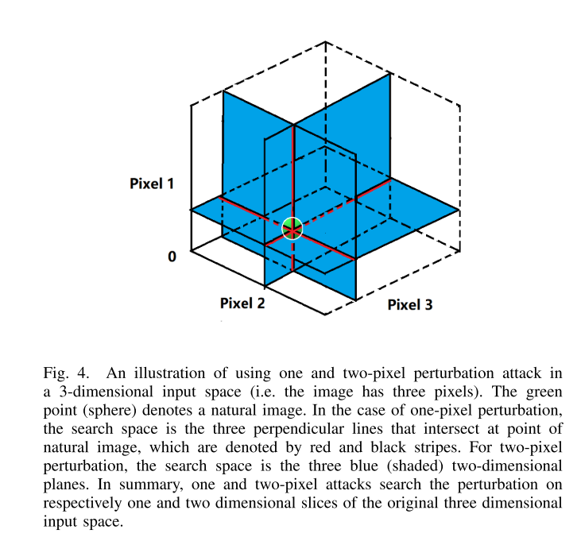

```
@article{su2019one,
author = {Su, Jiawei and Vargas, Danilo Vasconcellos and Sakurai, Kouichi},
journal = {IEEE Transactions on Evolutionary Computation},
publisher = {IEEE},
title = {{One pixel attack for fooling deep neural networks}},
year = {2019}
}
```

This paper investigated a extreme attack senerio which only allows one pixel modification. The main difference is that this method uses 0-norm of the noise vector as a constraint of number of pixels, while other methods use L-infinity or L2 to limit the amount of noise. Besides, one pixel method does not limit the strength of the modification. 



And this method adapted Differential Evolution(DE) to solve the objective function, which is one method of evolotionary algorithms(EA). There are three main advantages of DE:
- Higher probability of Finding Global Optima
- Require Less Information from Target System
- Simplicity

[Here](https://pablormier.github.io/2017/09/05/a-tutorial-on-differential-evolution-with-python/#) is a good tutorial of DE.
And [This](https://github.com/Hyperparticle/one-pixel-attack-keras) is the code in Keras.