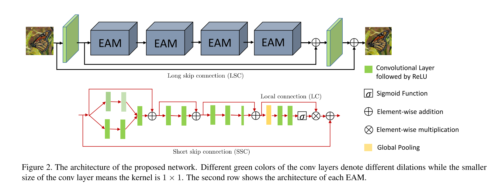

```
@inproceedings{Anwar_2019_ICCV,
author = {Anwar, Saeed and Barnes, Nick},
booktitle = {The IEEE International Conference on Computer Vision (ICCV)},
month = {oct},
title = {{Real Image Denoising With Feature Attention}},
year = {2019}
}
```
## Motivation
Deep convolutional neural networks perform better
on images containing spatially invariant noise (synthetic noise); however, their performance is limited on real-noisy photographs and requires multiple stage network modeling.

## Methods
They use a residual on the residual structure to ease the flow of low-frequency information and apply feature attention to exploit the channel dependencies.

