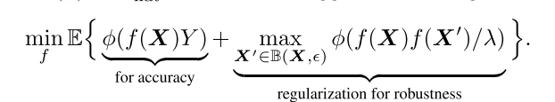

```
@inproceedings{pmlr-v97-zhang19p,
address = {Long Beach, California, USA},
author = {Zhang, Hongyang and Yu, Yaodong and Jiao, Jiantao and Xing, Eric and Ghaoui, Laurent El and Jordan, Michael},
booktitle = {Proceedings of the 36th International Conference on Machine Learning},
editor = {Chaudhuri, Kamalika and Salakhutdinov, Ruslan},
pages = {7472--7482},
publisher = {PMLR},
series = {Proceedings of Machine Learning Research},
title = {{Theoretically Principled Trade-off between Robustness and Accuracy}},
url = {http://proceedings.mlr.press/v97/zhang19p.html},
volume = {97},
year = {2019}
}
```
## Summary
This paper focuses on the trade-off between robustness and accuracy, and show an upper bound on the gap between robust error and optimal natural error. This paper features in decomposing the robustness and accuracy.
## Motivation
The robust error can in general be bounded tightly using two terms: one corresponds to the natural error measured by a surrogate loss function, and the other corresponds to how likely the input features are close to the $\epsilon$-extension of the dicision boundary, termed as the boundary error.
## Method(s)

The first term encourages the natural error to be optimized, and the second term encourages the output to be smooth as it pushes the decision boundary of classifier away from the sample instances via minimizing the difference between the prediction of natural examples and the adversarial examples.

See proof in the original paper.
## Evaluation
## Conclusion
## Related work