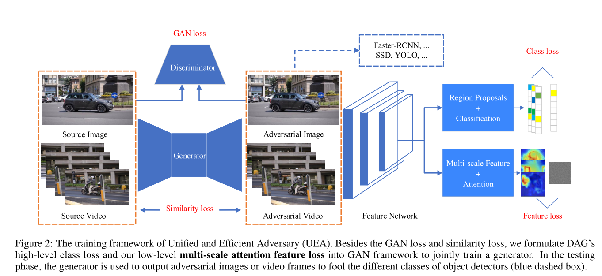
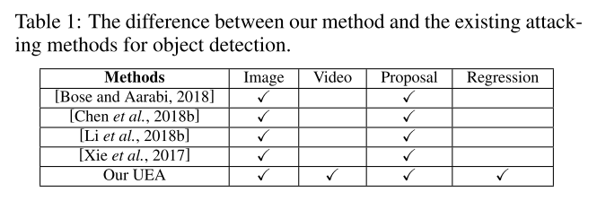

```
@inproceedings{ijcai2019-134,
author = {Wei, Xingxing and Liang, Siyuan and Chen, Ning and Cao, Xiaochun},
booktitle = {Proceedings of the Twenty-Eighth International Joint Conference on Artificial Intelligence, {\{}IJCAI-19{\}}},
doi = {10.24963/ijcai.2019/134},
pages = {954--960},
publisher = {International Joint Conferences on Artificial Intelligence Organization},
title = {{Transferable Adversarial Attacks for Image and Video Object Detection}},
url = {https://doi.org/10.24963/ijcai.2019/134},
year = {2019}
}
```
### Motivation 
Existing methods have two limitations: **weak transferability** and **high computation cost**.

### Methods
**Unified and Efficient Adversary (UEA)**


- **Multi-scale attention loss** enhances the transferability and imperceptibility.
- In the viewpoint of DNNs’ depth, DAG’s class loss is applied on the high-level softmax layer, and attention feature loss is performed on the low-level backend layer.
- UEA incorporates an additional feature loss to get the strong transferability.



#### Loss function
$$
\mathcal{L}_{c G A N}(\mathcal{G}, \mathcal{D})=\mathbb{E}_{I}[\log \mathcal{D}(I)]+\mathbb{E}_{I}[\log (1-\mathcal{D}(\mathcal{G}(I)))
$$

$$
\mathcal{L}_{L_{2}}(\mathcal{G})=\mathbb{E}_{I}\left[\|I-\mathcal{G}(I)\|_{2}\right]
$$

$$
\mathcal{L}_{D A G}(\mathcal{G})=\mathbb{E}_{I}\left[\sum_{n=1}^{N}\left[f_{l_{n}}\left(\mathbf{X}, t_{n}\right)-f_{\hat{l}_{n}}\left(\mathbf{X}, t_{n}\right)\right]\right]
$$

$$
\mathcal{L}_{F e a}(\mathcal{G})=\mathbb{E}_{I}\left[\sum_{m=1}^{M}\left\|\mathbf{A}_{m} \circ\left(\mathbf{X}_{m}-\mathbf{R}_{m}\right)\right\|_{2}\right]
$$

$$
\mathcal{L}=\mathcal{L}_{c G A N}+\alpha \mathcal{L}_{L_{2}}+\beta \mathcal{L}_{D A G}+\epsilon \mathcal{L}_{F e a}
$$
