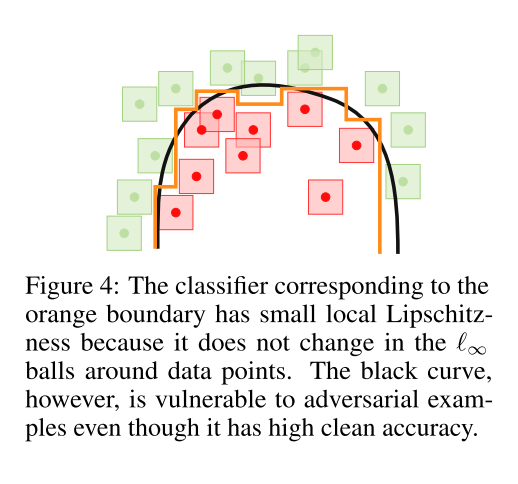

```
@article{2020arXiv200302460Y,
archivePrefix = {arXiv},
arxivId = {cs.LG/2003.02460},
author = {Yang, Yao-Yuan and Rashtchian, Cyrus and Zhang, Hongyang and Salakhutdinov, Ruslan and Chaudhuri, Kamalika},
eprint = {2003.02460},
journal = {arXiv e-prints},
keywords = {Computer Science - Cryptography and Security,Computer Science - Machine Learning,Statistics - Machine Learning},
month = {mar},
pages = {arXiv:2003.02460},
primaryClass = {cs.LG},
title = {{A Closer Look at Accuracy vs. Robustness}},
year = {2020}
}
```
## Summary
I think this paper is worthy reading more times.

## Motivation
A tradeoff between robustness and accuracy may be inevitable for many classification.
## Method(s)
**Real data is $r-$separated where $r$ is equal to the attack radii commonly used in adversarial robustness experiments.** $r-$separation means examples from different classes are at least distance $2r$ apart in pixel space.
This imply that in real image, the test iamges are far apart from training images from a different class. There perhaps are images of dogs which look like cats, but standard image datasets are quite clean, and such images mostly do not occur in either their test nor the training sets.

**Theoretically if a data distribution is $r-$separated, then there exists a robust and accurate classifier that can be obtained by rounding a locally Lipschistz function.**



Figure 4 shows a pictorial example of why using a locally Lipschitz function can be just as expressive while also being robust.
## Evaluation
## Conclusion
## Related work


[Presentation](https://slideslive.at/38930945/a-closer-look-at-accuracy-vs-robustness?ref=speaker-24616-latest)