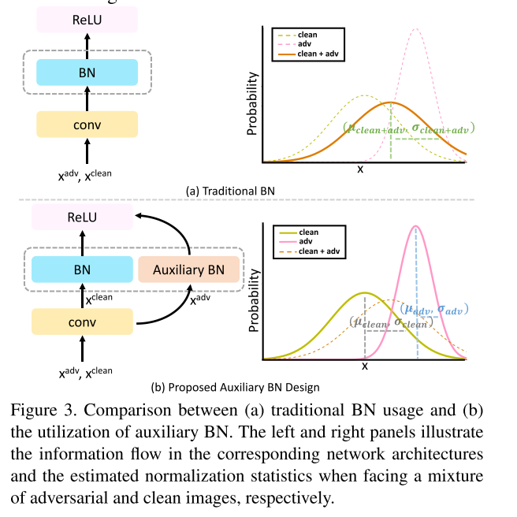
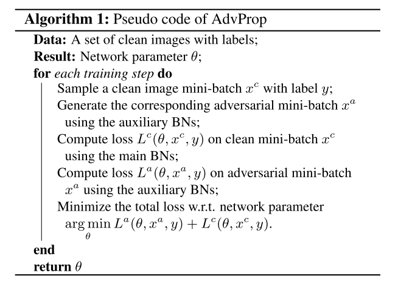

```
@inproceedings{Xie_2020_CVPR,
author = {Xie, Cihang and Tan, Mingxing and Gong, Boqing and Wang, Jiang and Yuille, Alan L and Le, Quoc V},
booktitle = {IEEE/CVF Conference on Computer Vision and Pattern Recognition (CVPR)},
month = {jun},
title = {{Adversarial Examples Improve Image Recognition}},
year = {2020}
}
```
## Summary
This paper proposed to disentangle the distribution of adversarial examples and clean images via a auxiliary batch normalization to improve the performances on clean images. However, I did not see anything comparing adversarial robustness.

## Motivation
All previous methods jointly train over clean images and adversarial images without distinction even though they should be drawn from different underlying distributions. 
This distribution mismatch between clean images and adversarial examples is a key factor that causes the performance degradation. 
## Method(s)
### Adversarial Propagation
short for AdvProp, a new training scheme that bridges the distribution mismatch with a simple yet highly effective two batchnorm approach: one for clean images and one auxiliary for adversarial examples.
**The two batchnorms properly disentangle the two distributions at normalization layers for accurate statistics estimation.**
This method can be seen as one type of adata augmentation: creating addtional traiing samples by injecting noises. The biggest difference is that previous attempts fail to improve accuracy on clean images.

Adversarially trained models usually cannot generalize well on clean images. 
In this paper, such performance degradation is mainly caused by **distribution mismatch -- adversarial examples and clean images are drawn from two different domains.**
To validate, this paper examine a simple strategy -- pre-trained networks with adversarial examples first, then fine-tune with clean images.
And it is found that this simple fine-tuning strategy always yields much higher accuracy than Madry's adversarial training.
This releases a promising signal:**adversarial examples can be benefical for model performance if harnessed properly**.





## Evaluation

## Conclusion
## Related work