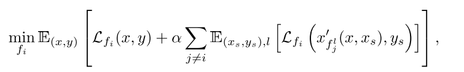
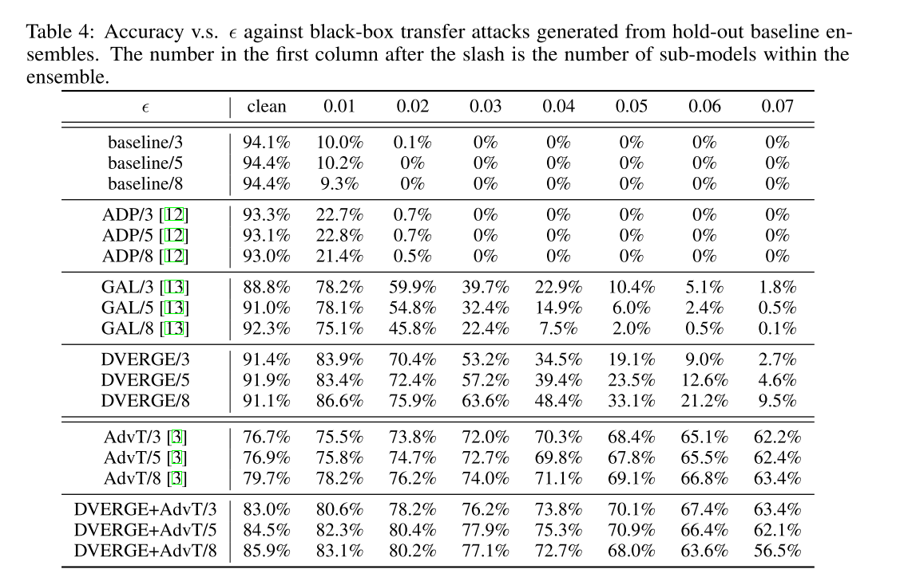
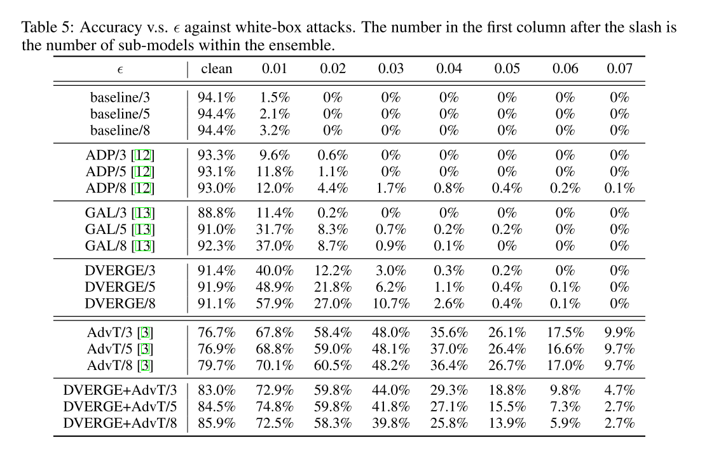

```
@misc{yang2020dverge,
archivePrefix = {arXiv},
arxivId = {cs.LG/2009.14720},
author = {Yang, Huanrui and Zhang, Jingyang and Dong, Hongliang and Inkawhich, Nathan and Gardner, Andrew and Touchet, Andrew and Wilkes, Wesley and Berry, Heath and Li, Hai},
eprint = {2009.14720},
title = {{DVERGE: Diversifying Vulnerabilities for Enhanced Robust Generation of Ensembles}},
year = {2020}
}
```
## Summary
This paper aims to enhance the robustness under black-box attacks. It ensembles several models and forces them to learn different non-robust features. This is based on the assumption that transferability is caused by non-robust features.
## Motivation
Sub-models in ensemble are vulnerable along the same axis of a transfer attack, which is the reason of high transferability of adversarial attacks.
## Method(s)
without adversarial training


with adversarial training
$$
\min _{f_{i}} \mathbb{E}_{(x, y),\left(x_{s}, y_{s}\right), l}[\underbrace{\lambda \cdot \sum_{j \neq i} \mathcal{L}_{f_{i}}\left(x_{f_{j}^{l}}^{\prime}\left(x, x_{s}\right), y_{s}\right)}_{\text {DVERGE loss }}+\underbrace{\max _{\delta \in \mathcal{S}} \mathcal{L}_{f_{i}}\left(x_{s}+\delta, y_{s}\right)}_{\text {AdvT loss }}]
$$

## Evaluation




It is worth noting that with adversarial training, the performance is worse than simply adversarial training.

## Conclusion

## Related work