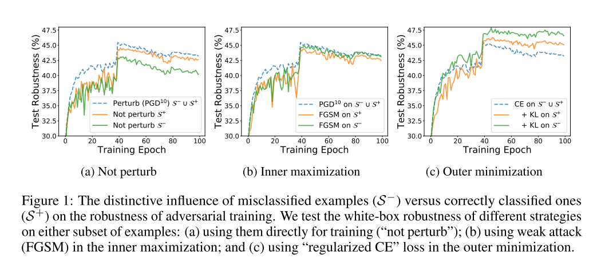
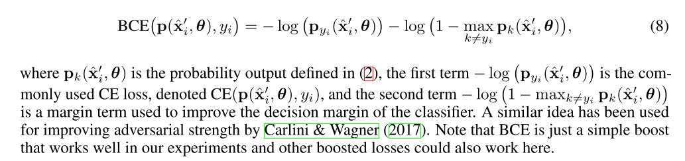
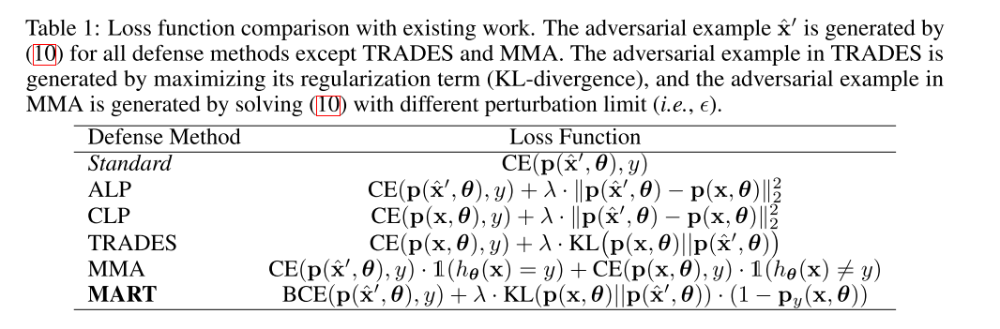

```
@inproceedings{wang2020improving,
author = {Wang, Yisen and Zou, Difan and Yi, Jinfeng and Bailey, James and Ma, Xingjun and Gu, Quanquan},
booktitle = {International Conference on Learning Representations},
title = {{Improving Adversarial Robustness Requires Revisiting Misclassified Examples}},
url = {https://openreview.net/forum?id=rklOg6EFwS},
year = {2020}
}
```
## Motivation
the manipulation on misclassified examples has more impact on the final robustness, and the minimization techniques are more crucial than maximization ones under the min-max optimization framework.







## Thoughts
A high quality paper!