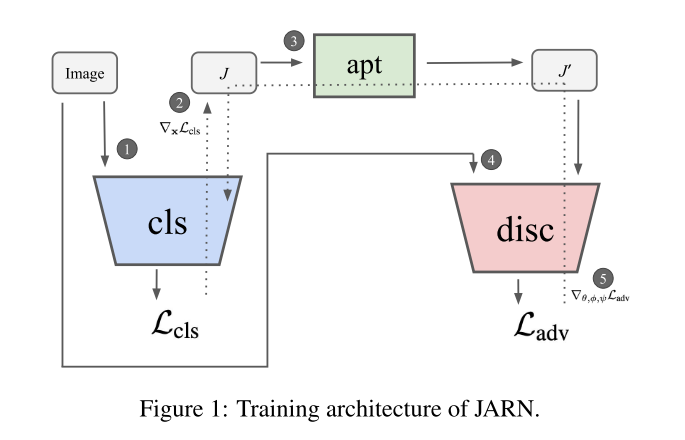
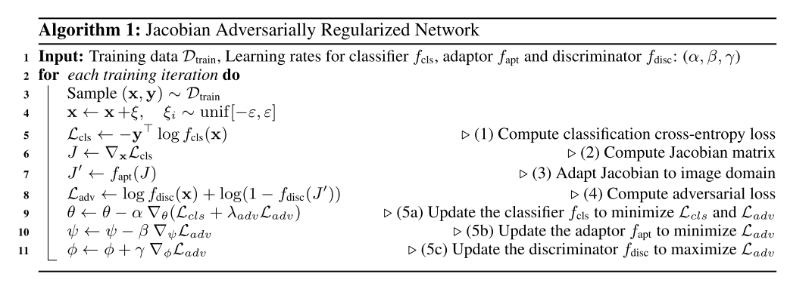

```
@inproceedings{chan2020jacobian,
author = {Chan, Alvin and Tay, Yi and Ong, Yew Soon and Fu, Jie},
booktitle = {International Conference on Learning Representations},
title = {{Jacobian Adversarially Regularized Networks for Robustness}},
url = {https://openreview.net/forum?id=Hke0V1rKPS},
year = {2020}
}
```
## Motivation
Previous studies have pointed out that robust models that have undergone adversarial training tend to produce **more salient and interpretable Jacobian matrices** than their non-robust counterparts.

## Methods
Jacobian Adversarially Regularized Networks(JARN). The classifier learns to produce salient Jacobians with a regularization objective to fool a discriminator network into classifying them into classifying them as input images.




## Thoughts
Can I use a regulization on dinoising?
