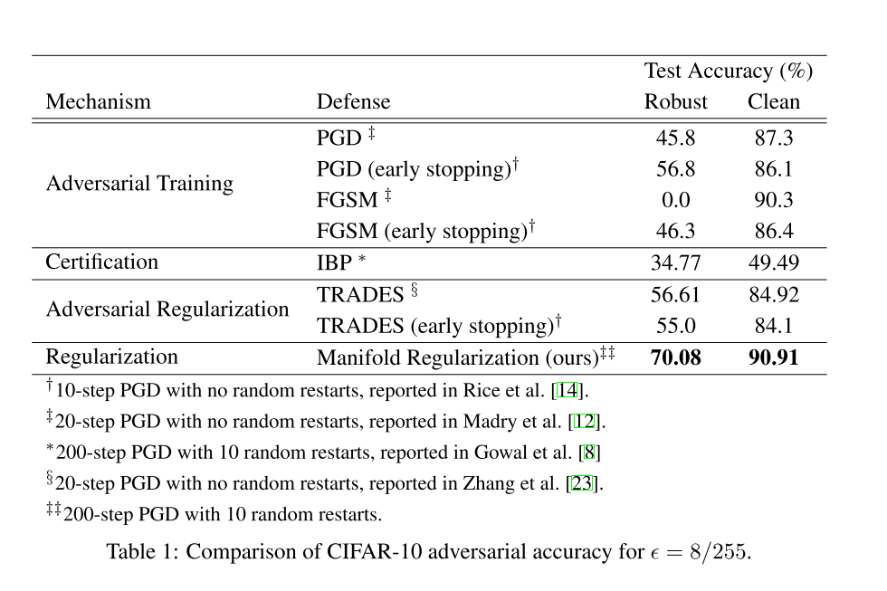

```
@article{jin2020manifold,
author = {Jin, Charles and Rinard, Martin},
journal = {arXiv preprint arXiv:2003.04286},
title = {{Manifold regularization for adversarial robustness}},
year = {2020}
}
```
## Summary
This paper uses manifold regularization to achieve the goal of local stability, and improves the adversarial robustness.

## Motivation
#### Local stability
The key insight is learning a function which does not vary much in small neighborhoods of natural inputs, **even if the network classifies incorrectly**. (this is a big difference from adversarial training)

## Method(s)
Manifold regularization are based on the assumption that the input data is not drawn uniformly from the input domain $X$, but rather supported on a submanifold $M \subset X$. This assumption is natural for, e.g., vision tasks, where a randomly drawn image is almost certainly noise.

A function $f$ is $\epsilon-stable$ at an input $x$ ifthere does not exist a perturbation $x'$ in the $\epsilon-neighborhood$ of $x$ such that $f(x) \neq f(x')$.

### Stochastic Manifold Regularization
$$\|f\|_{I}^{2} \approx \frac{1}{N_{b}^{2}} \sum_{i, j=1}^{N_{b}}\left(f\left(x_{i}\right)-f\left(x_{j}\right)\right)^{2} W_{i, j},$$
where the sum is over the samples in a mini-batch.

One benefit of this approach is that the regularization comes at nearly zero overhead when training via stochastic gradient descent.

### Hamming Embeddings
$\epsilon$-stability clearly modifies the intrinsic geometry by expanding the input submanifold to its $\epsilon$-neighborhood; furthermore, the density of this expanded manifold should be fairly constant in every $\epsilon$-ball, since every point in the $\epsilon$-ball is equally “important” for evaluation.

One obvious way to extend the previous approach for $\epsilon$-stability is to simply replace every input with a random perturbation from its $\epsilon$-ball at training time. 
**The intrinsic geometry is often assumed to be a much lower dimension submanifold, while the $\epsilon$-ball lifts the submanifold back to the full dimension of the ambient space, and thus may require much higher sample complexity to learn. Indeed, as our experiments show, this approach can actually hurt the robustness of the network.**

$$\|H(\cdot ; \theta)\|_{I}^{2} \approx \frac{1}{N^{2}} \sum_{i=1}^{N} H\left(x_{i}^{+}, x_{i}^{-} ; \theta\right)^{2} W_{i^{+}, i^{-}}$$

## Evaluation

## Conclusion
1. higher adversarial and natural robustness.
2. suggesting that encouraging the netowrk to be locally stable on the intrinsic geometry of the input submanifold leads to fundamentally different optima than using adversarial examples.
3. No inner optimization loop to find strong perturbations at training time.


## Reference
1. Manifold regularization: A geometric framework for learning from labeled and unlabeled examples
2. Taehoon Lee, Minsuk Choi, and Sungroh Yoon. Manifold regularized deep neural networks using adversarial examples, 2015.