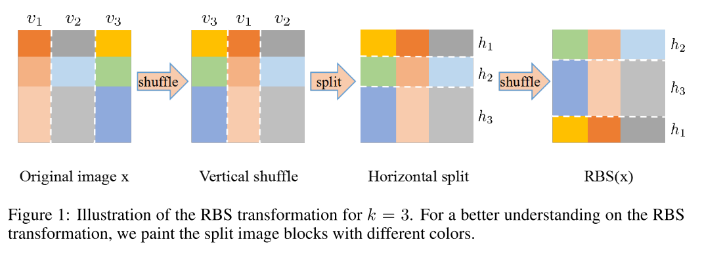
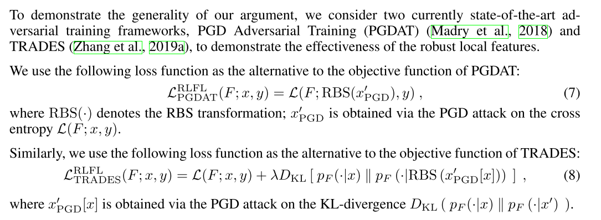
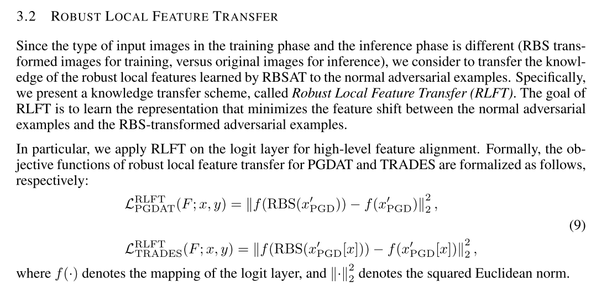

```
@inproceedings{song2020robust,
author = {Song, Chuanbiao and He, Kun and Lin, Jiadong and Wang, Liwei and Hopcroft, John E},
booktitle = {International Conference on Learning Representations},
title = {{Robust Local Features for Improving the Generalization of Adversarial Training}},
url = {https://openreview.net/forum?id=H1lZJpVFvr},
year = {2020}
}
```
This paper points out that adversarially trained models are more biased towards global stucture features. This paper investigate the relationship between the generalization of adversarial training and the robust local features.

To learn local features, they proposed Random Block Shuffle(RBS) to break up the gloabal sturcture of the images, at the same time retaining the local features.


Generalized RBS adversarial training(RBSAT).



For feature alignment
