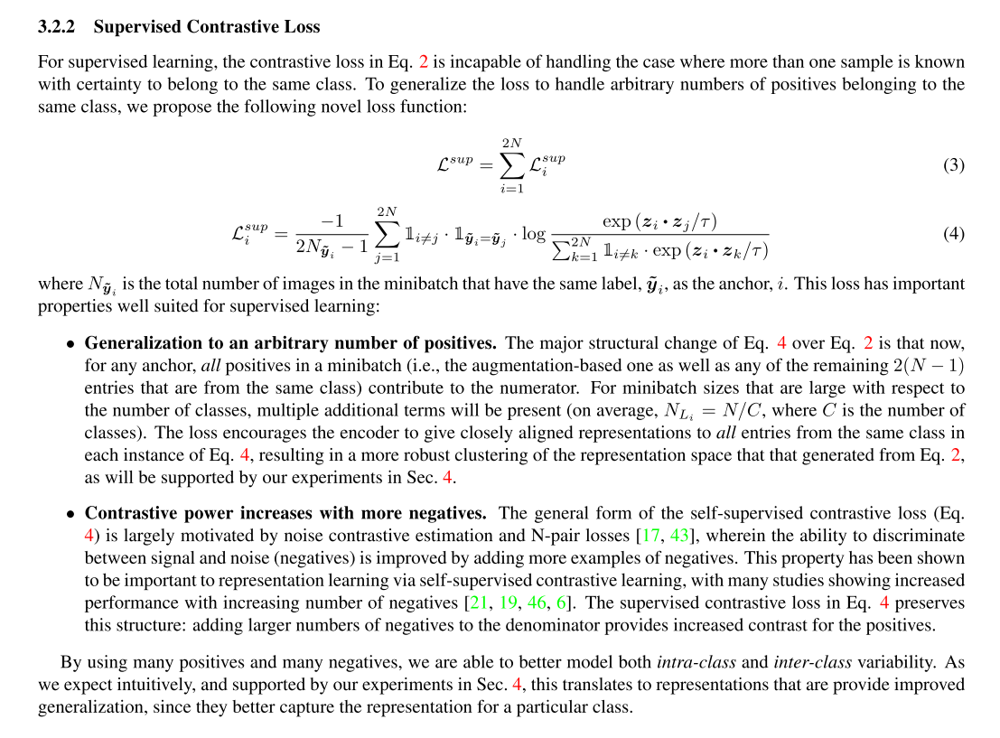

```
@article{2020arXiv200411362K,
archivePrefix = {arXiv},
arxivId = {cs.LG/2004.11362},
author = {Khosla, Prannay and Teterwak, Piotr and Wang, Chen and Sarna, Aaron and Tian, Yonglong and Isola, Phillip and Maschinot, Aaron and Liu, Ce and Krishnan, Dilip},
eprint = {2004.11362},
journal = {arXiv e-prints},
keywords = {Computer Science - Computer Vision and Pattern Rec,Computer Science - Machine Learning,Statistics - Machine Learning},
month = {apr},
pages = {arXiv:2004.11362},
primaryClass = {cs.LG},
title = {{Supervised Contrastive Learning}},
year = {2020}
}
```
consider about the hard positives and hard negatives.


