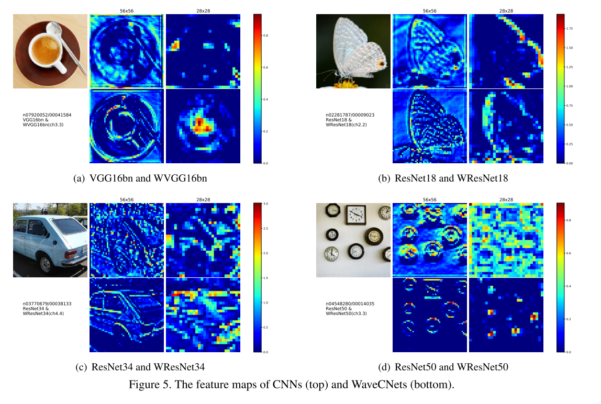

```
@misc{li2020wavelet,
archivePrefix = {arXiv},
arxivId = {cs.CV/2005.03337},
author = {Li, Qiufu and Shen, Linlin and Guo, Sheng and Lai, Zhihui},
eprint = {2005.03337},
primaryClass = {cs.CV},
title = {{Wavelet Integrated CNNs for Noise-Robust Image Classification}},
year = {2020}
}
```

Our method is trying to apply wavelet transforms to improve the down-sampling operations in deep networks. 

