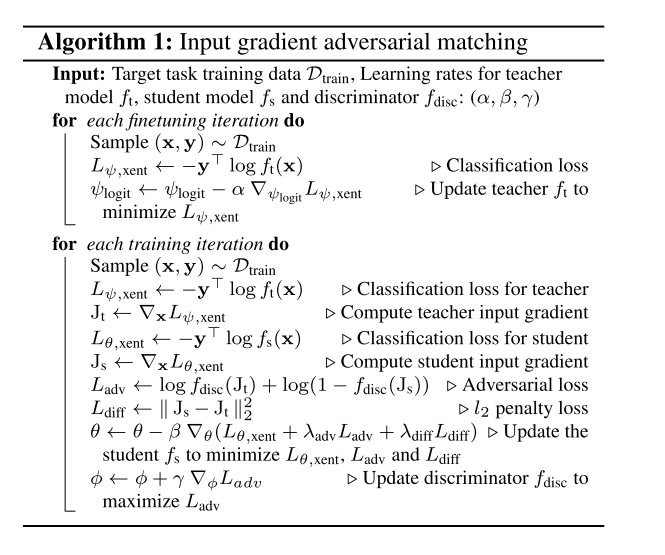
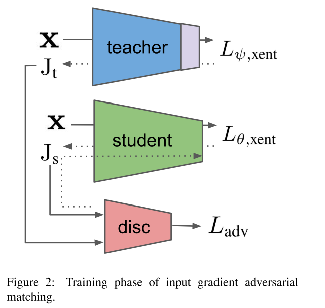

```
@article{2019arXiv191205699C,
archivePrefix = {arXiv},
arxivId = {cs.LG/1912.05699},
author = {Chan, Alvin and Tay, Yi and Ong, Yew-Soon},
eprint = {1912.05699},
journal = {arXiv e-prints},
month = {dec},
pages = {arXiv:1912.05699},
primaryClass = {cs.LG},
title = {{What it Thinks is Important is Important: Robustness Transfers through Input Gradients}},
year = {2019}
}
```

## Motivation
Learned weights of models robust to adversarial perturbations are previously found to be transferable across different tasks but this applies only if the model architecture for the source and target tasks is the same.

Input gradients characterize how small changes at each input pixel affect the model output.

## Methods
Input gradient adversarial matching (IGAM).
The core idea behind our approach is to train a student
model with an adversarial objective to fool a discriminator into perceiving the student’s input gradients as those from a robust teacher model. To transfer across different tasks, the teacher model’s logit layer is first briefly finetuned on the target task’s data.





## Thoughts
I think it is similar to distillation in some ways. Can I adopt it to distillation?